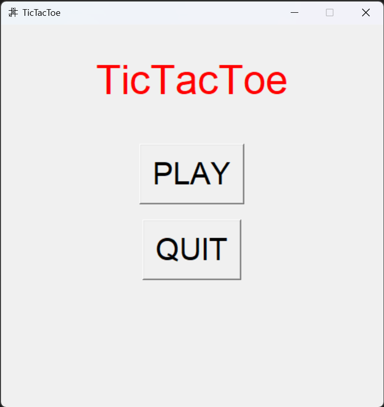
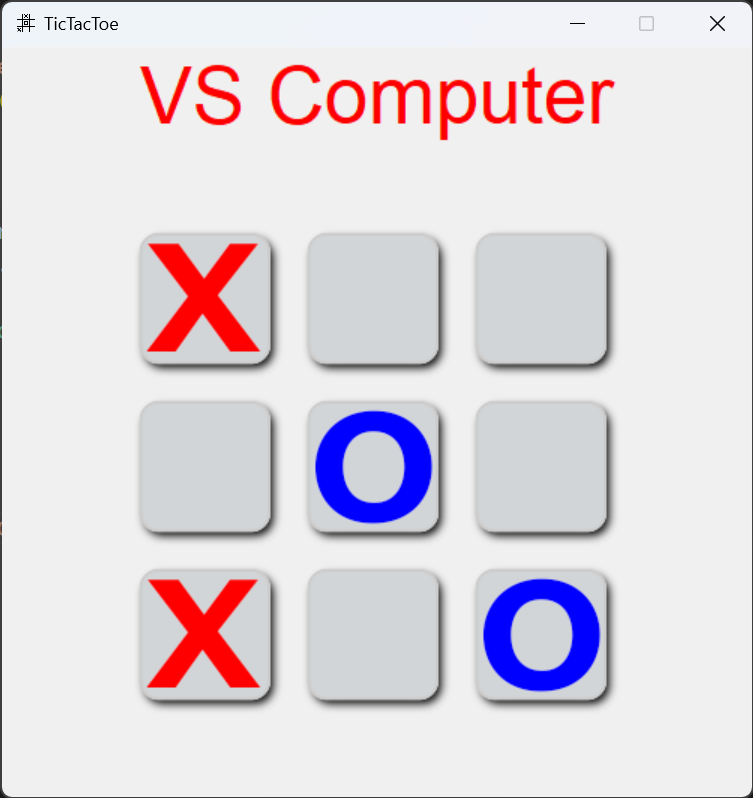

# Tic Tac Toe Game

## Description

This is a simple implementation of the Tic Tac Toe game. It allows a player to challange the machine in marking spaces on a 3x3 grid, aiming to get three of their symbols in a row, column, or diagonal.

## Screenshots

### Main Menu



### In-Game



## Features

- Single-player gameplay: Player and Computer take turns marking spaces with their respective symbols.
- Win detection: The game detects when a player has achieved three of their symbols in a row, column, or diagonal.
- Draw detection: If all spaces are filled without a winner, the game declares a draw.
- Restart option: After a game ends, players have the option to restart and play again.

## Controls

- Players alternate turns by clicking on an empty space on the game grid.
- The game automatically detects when a player wins or when the game ends in a draw.

## Technologies Used

- Programming Language: Python
- Graphics Library: Tkinter

## How to Run

Simply run TicTacToe.py file

```bash
python TicTacToe.py
```

## Possible Future Improvements

- Enhanced graphics and animations.
- Additional game modes or variations.
- Adding computer opponent difficulty level.
